# Maker-Checker Process Documentation

This document visualizes the maker-checker workflows defined in `workflowConfig.js`.

## Workflow Overview

The system implements different approval workflows based on the transaction type and amount.

```mermaid
graph TD
    %% Styling
    classDef startend fill:#f9f,stroke:#333,stroke-width:2px;
    classDef decision fill:#ff9,stroke:#333,stroke-width:2px;
    classDef process fill:#e1f5fe,stroke:#01579b,stroke-width:2px;
    classDef approval fill:#c8e6c9,stroke:#2e7d32,stroke-width:2px;

    %% DEPOSIT TRANSACTIONS
    subgraph DEPOSIT [Deposit Transaction]
        direction TB
        D_Start([Start]) --> D_Check{Amount}
        
        %% Standard Deposit
        D_Check -- "< 10k" --> D_Standard[Standard Deposit]
        D_Standard --> D_L1_1[L1 Approval<br/>1 Required<br/>Roles: DEPOSIT_CHECKER_L1, SENIOR_DEPOSIT_CHECKER]
        D_L1_1 --> D_End([End])

        %% Medium Deposit
        D_Check -- "10k - 100k" --> D_Medium[Medium Deposit]
        D_Medium --> D_L1_2[L1 Approval<br/>1 Required<br/>Roles: DEPOSIT_CHECKER_L1, SENIOR_DEPOSIT_CHECKER]
        D_L1_2 --> D_L2_1[L2 Approval<br/>1 Required<br/>Roles: DEPOSIT_CHECKER_L2, SENIOR_DEPOSIT_CHECKER]
        D_L2_1 --> D_End

        %% Large Deposit
        D_Check -- ">= 100k" --> D_Large[Large Deposit]
        D_Large --> D_L1_3[L1 Approval<br/>2 Required<br/>Roles: DEPOSIT_CHECKER_L1, SENIOR_DEPOSIT_CHECKER]
        D_L1_3 --> D_L2_2[L2 Approval<br/>1 Required<br/>Roles: DEPOSIT_CHECKER_L2, SENIOR_DEPOSIT_CHECKER]
        D_L2_2 --> D_Senior[Senior Approval<br/>1 Required<br/>Roles: SENIOR_MANAGER, FINANCE_DIRECTOR]
        D_Senior --> D_End
    end

    %% JOURNAL ENTRIES
    subgraph JOURNAL [Journal Entry]
        direction TB
        J_Start([Start]) --> J_Check{Amount}

        %% Standard Journal
        J_Check -- "< 50k" --> J_Standard[Standard Journal]
        J_Standard --> J_Mgr_1[Manager Approval<br/>1 Required<br/>Roles: ACCOUNTING_MANAGER, SENIOR_ACCOUNTANT]
        J_Mgr_1 --> J_End([End])

        %% Large Journal
        J_Check -- ">= 50k" --> J_Large[Large Journal]
        J_Large --> J_Mgr_2[Manager Approval<br/>1 Required<br/>Roles: ACCOUNTING_MANAGER, SENIOR_ACCOUNTANT]
        J_Mgr_2 --> J_Dir[Director Approval<br/>1 Required<br/>Roles: FINANCE_DIRECTOR, CFO]
        J_Dir --> J_End
    end

    %% PAYMENT TRANSACTIONS
    subgraph PAYMENT [Payment Transaction]
        direction TB
        P_Start([Start]) --> P_Check{Amount}

        %% Small Payment
        P_Check -- "< 5k" --> P_Small[Small Payment]
        P_Small --> P_Chk_1[Checker Approval<br/>1 Required<br/>Roles: PAYMENT_CHECKER, TREASURY_MANAGER]
        P_Chk_1 --> P_End([End])

        %% Medium Payment
        P_Check -- "5k - 50k" --> P_Medium[Medium Payment]
        P_Medium --> P_Chk_2[Checker Approval<br/>1 Required<br/>Roles: PAYMENT_CHECKER, TREASURY_MANAGER]
        P_Chk_2 --> P_Treasury_1[Treasury Approval<br/>1 Required<br/>Roles: TREASURY_MANAGER, SENIOR_MANAGER]
        P_Treasury_1 --> P_End

        %% Large Payment
        P_Check -- ">= 50k" --> P_Large[Large Payment]
        P_Large --> P_L1_4[L1 Approval<br/>2 Required<br/>Roles: PAYMENT_CHECKER]
        P_L1_4 --> P_L2_3[L2 Approval<br/>1 Required<br/>Roles: TREASURY_MANAGER]
        P_L2_3 --> P_Senior_2[Senior Approval<br/>1 Required<br/>Roles: FINANCE_DIRECTOR, CFO]
        P_Senior_2 --> P_End
    end

    %% LOAN DISBURSEMENTS
    subgraph LOAN [Loan Disbursement]
        direction TB
        L_Start([Start]) --> L_Check{Amount}

        %% Standard Disbursement
        L_Check -- "< 25k" --> L_Standard[Standard Disbursement]
        L_Standard --> L_Mgr_3[Manager Approval<br/>1 Required<br/>Roles: LOAN_MANAGER]
        L_Mgr_3 --> L_End([End])

        %% Large Disbursement
        L_Check -- ">= 25k" --> L_Large[Large Disbursement]
        L_Large --> L_Mgr_4[Manager Approval<br/>1 Required<br/>Roles: LOAN_MANAGER]
        L_Mgr_4 --> L_Risk[Risk Approval<br/>1 Required<br/>Roles: RISK_MANAGER]
        L_Risk --> L_End
    end

    class D_Start,D_End,J_Start,J_End,P_Start,P_End,L_Start,L_End startend;
    class D_Check,J_Check,P_Check,L_Check decision;
    class D_Standard,D_Medium,D_Large,J_Standard,J_Large,P_Small,P_Medium,P_Large,L_Standard,L_Large process;
    class D_L1_1,D_L1_2,D_L2_1,D_L1_3,D_L2_2,D_Senior,J_Mgr_1,J_Mgr_2,J_Dir,P_Chk_1,P_Chk_2,P_Treasury_1,P_L1_4,P_L2_3,P_Senior_2,L_Mgr_3,L_Mgr_4,L_Risk approval;
```

